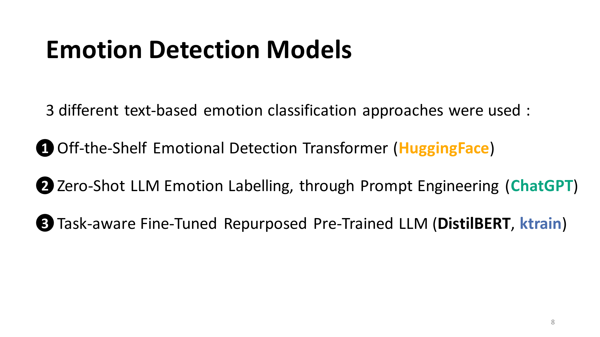
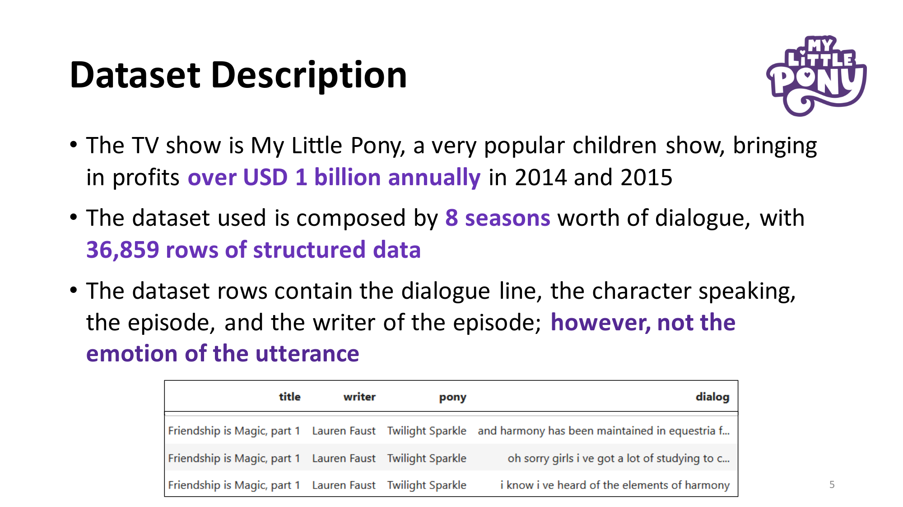
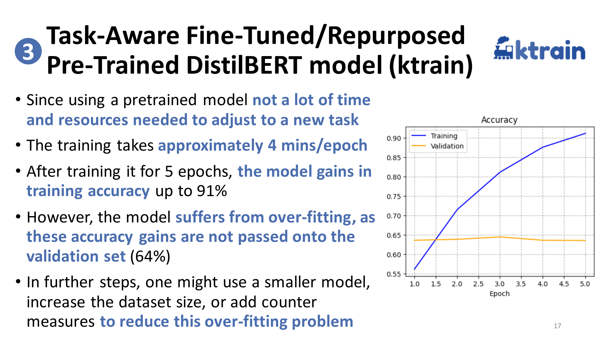
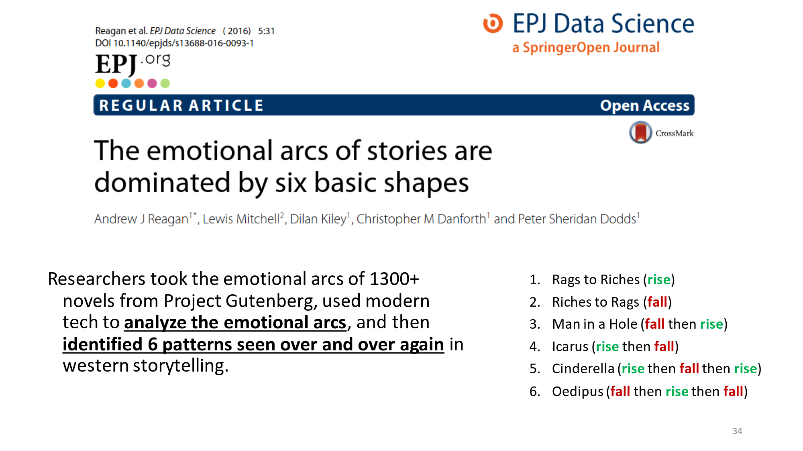
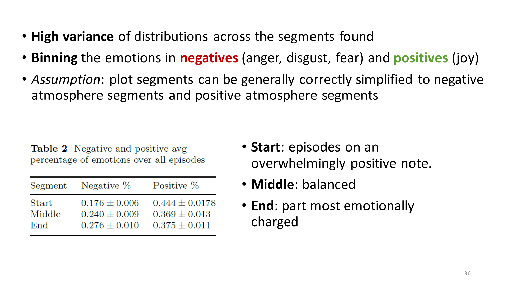
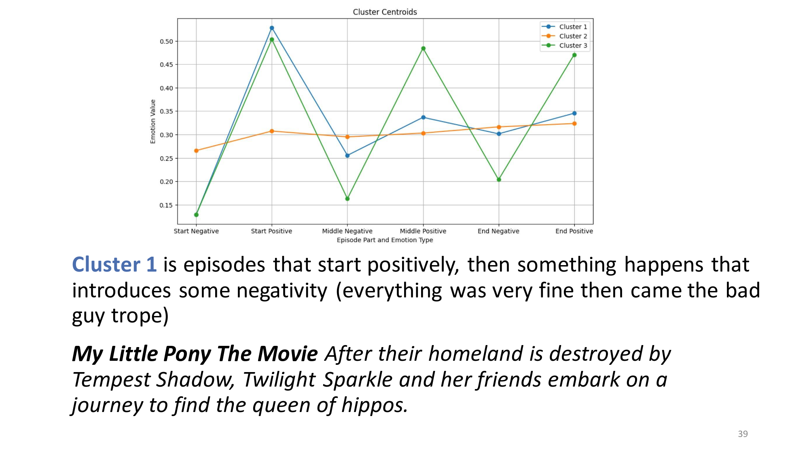

# Text-Based Emotion Detection on episodes of My Little Pony
Project for Text Mining and Sentiment Analysis course.  
Emotion detection for a popular children TV show using multiple NLP approaches, in addition to analysis.  

*Organisational Note:*
* The CSV files have been separated into their own folders.
* The project has been split across multiple notebooks for clarity.

### Presentation preview
Following are some slides taken from the powerpoint presentation used to present the study keypoints.

